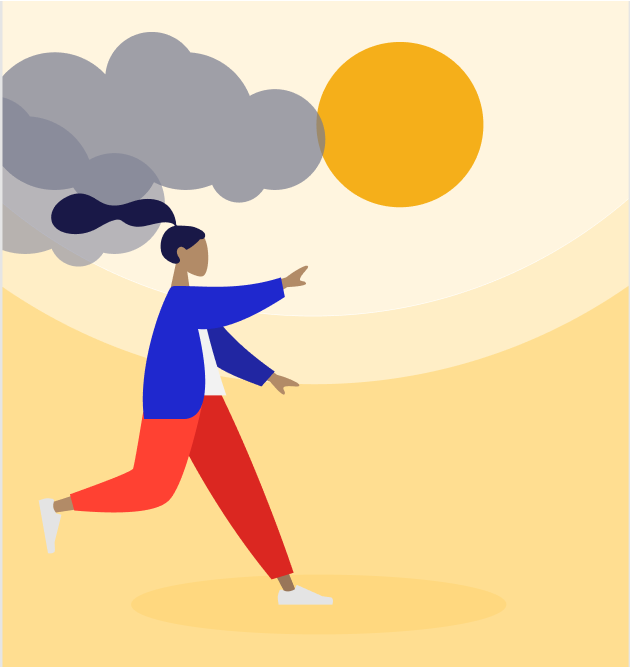
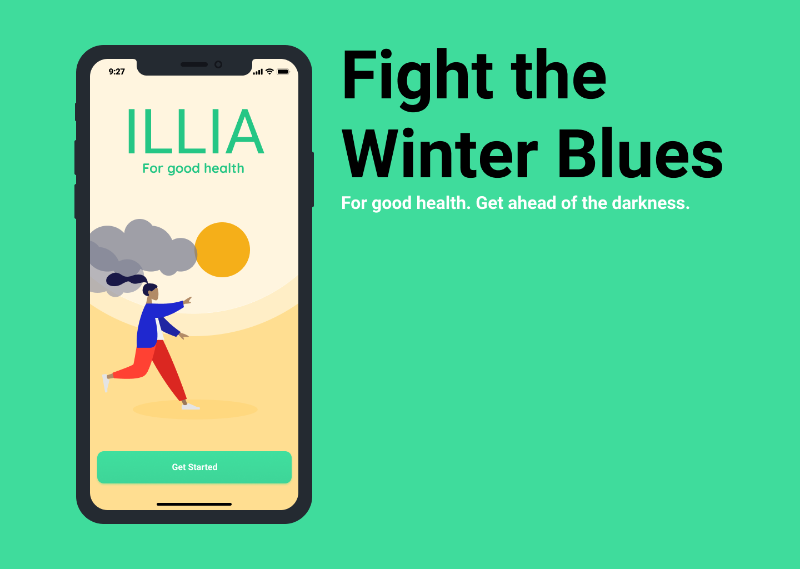

#  Illia
Illia helps fight the “winter blues” by suggesting daily activities that give users a small win. With science-based activities designed to maintain physical and mental health, and a mood tracker to provide awareness, users can take charge of their day.

Part of Nordic Health Hackathon 2020
 
 

 
 

Video of the project:  

## Team

* [Brittany Van Dyk](https://github.com/britvandyk)
* [Florian Wachter](https://github.com/FloWachter)
* [Pontus Åberg](https://github.com/aBergPontus)
* [Simon Takman](https://github.com/SimonTakman)

## Design
       

## Test application
Open your mobile browser and go to [http://illia.netlify.app/](http://illia.netlify.app/).

## Setup and Run

For frontend: Go to `frontend/` folder and follow the instructions from [README.md](/frontend/README.md).

For backend: Go to `backend/` folder and follow the instructions from [README.md](/backend/README.md).